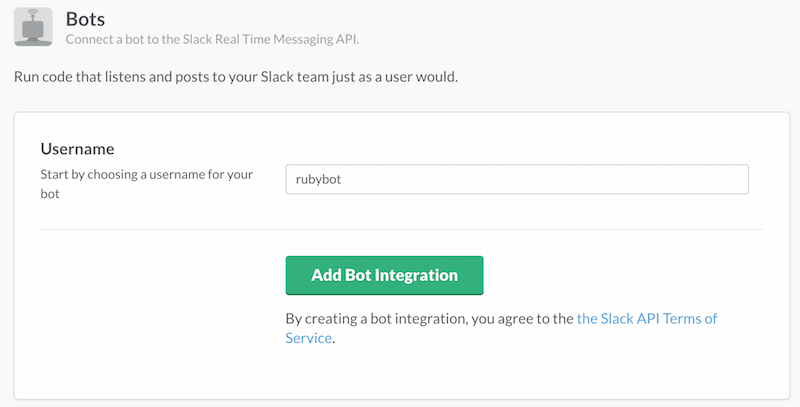

## BOT API Basics

[Slack-ruby-bot](https://github.com/dblock/slack-ruby-bot) makes it all very easy.

### Make a Team

Sign up at [slack.com](https://slack.com), my team is _dblockdotorg.slack.com_.

### Create a New Bot Integration

This is something done in Slack, under [integrations](https://slack.com/services). Create a [new bot](https://slack.com/services/new/bot), and note its API token.



### Gemfile

```ruby
source 'http://rubygems.org'

gem 'slack-ruby-bot'
```

### Use Slack-Ruby-Bot

Much easier with a library.

```ruby
require 'slack-ruby-bot'

class Bot < SlackRubyBot::Bot
  command 'hi' do |client, data, _match|
    client.message text: "hi <@#{data.user}>", channel: data.channel
  end
end

Bot.instance.run
```

Working code in [05-bot.rb](05-bot.rb).
